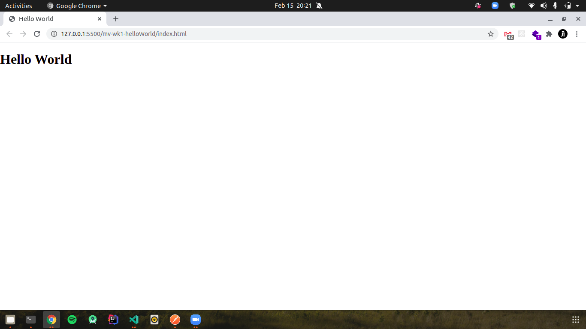

# Microverse - Week 1 Hello World

> This is a simple hello world project that shows how to set up linters and use github workflows.

## Uses With

- Style Lint
- WebHint
- Lighthouse

## Authors

👤 **Joshua Ivie**

- GitHub: [@joshuaivie](https://github.com/joshuaivie)
- Twitter: [@joshuaivie\_](https://twitter.com/joshuaivie_)
- LinkedIn: [joshuaivie](https://linkedin.com/in/joshuaivie)

👤 **Emmy NSABIMANA**

- GitHub: [@emmyn5600](https://github.com/emmyn5600)
- Twitter: [@NSABIMA62253884](https://twitter.com/NSABIMA62253884)
- LinkedIn: [LinkedIn](https://linkedin.com/in/nsabimana-emmanuel-4276091b2)

## 🤝 Contributing

Contributions, issues, and feature requests are welcome!
Feel free to check the [issues page](issues/).

## Show your support

Give a ⭐️ if you like this project!

## Acknowledgments

- Hat tip to anyone whose code was used
- Inspiration
- etc

## 📝 License

This project is [MIT](lic.url) licensed.
